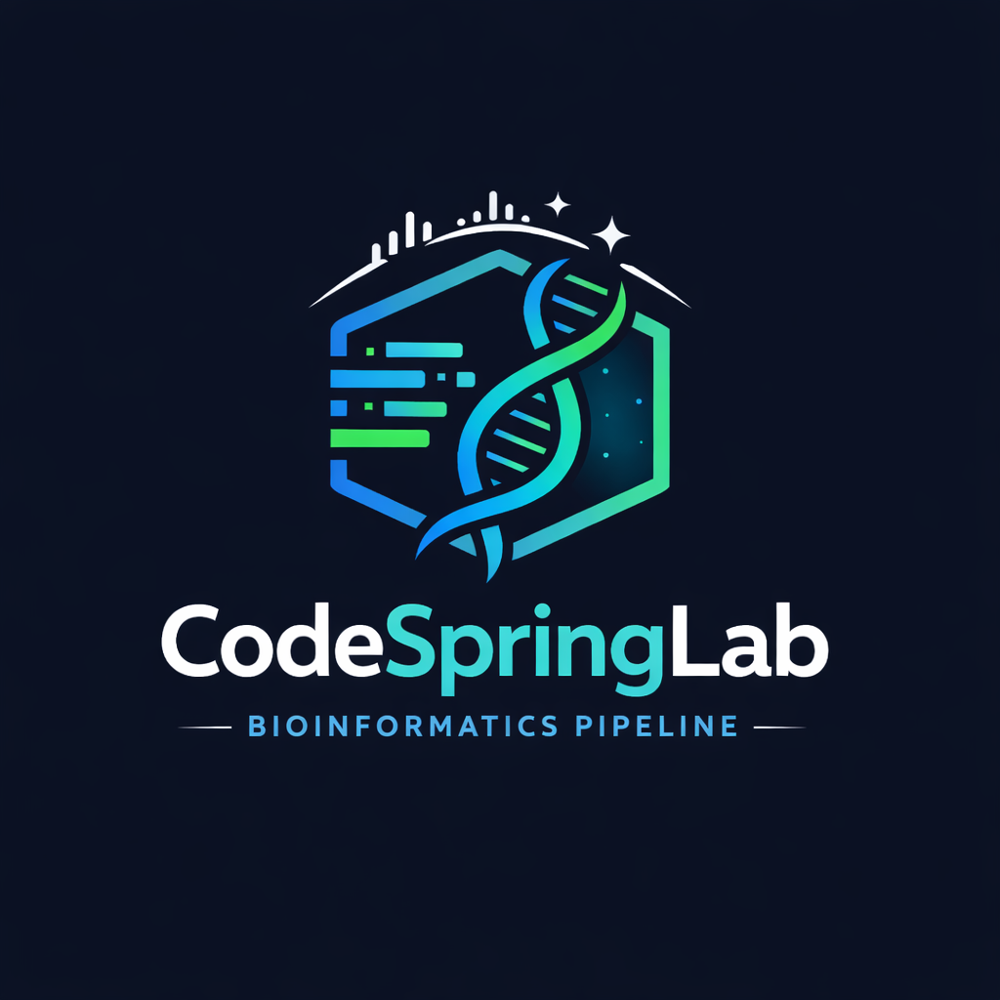
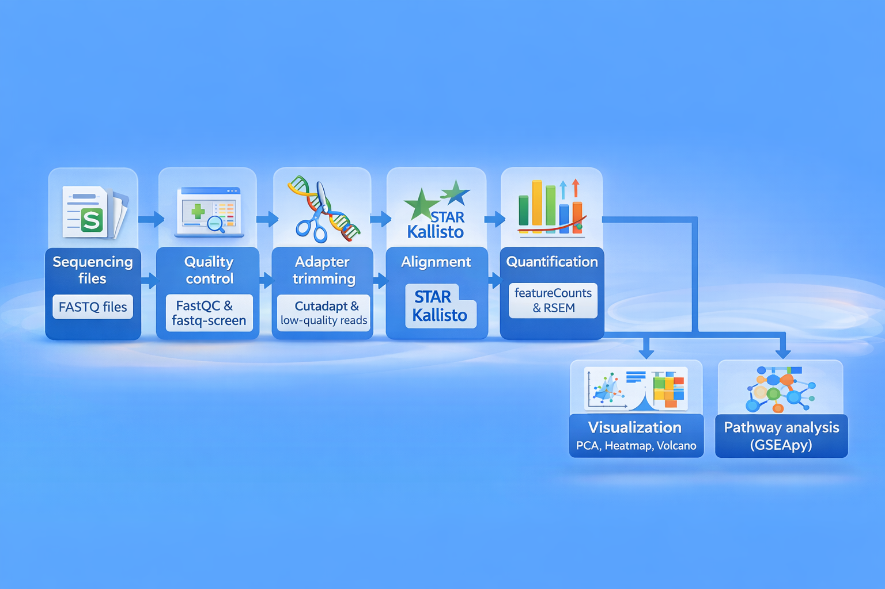
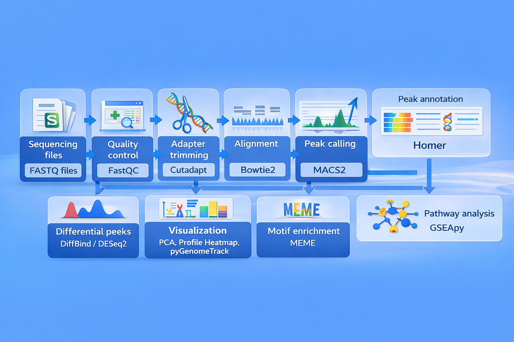

   

# CodeSpringLab
Collection of bioinformatics pipelines and scripts for Cold Spring Harbor Laboratory created by BSR (Bioinformatics shared resources)
Created by Raditya Utama, Alex Dobin, and James Rouse

First release: March 2023

# Highlights
1. Bulk RNA-seq:

   

2. Bulk ATAC-seq:

   

3. Bulk ChIP-seq:
   

   

   
   
